# Configuration file

## Syntax
##### config-file:
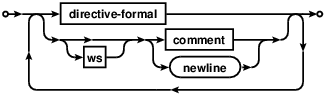
##### directive:
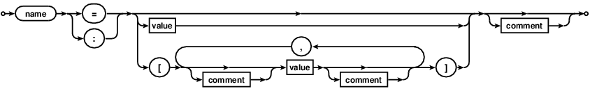
##### directive-formal:
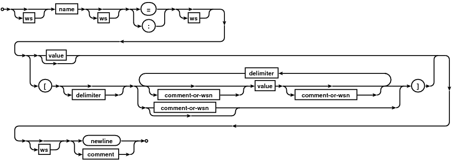
##### comment:
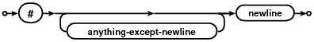
##### comment-or-wsn:
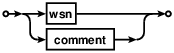
##### value:
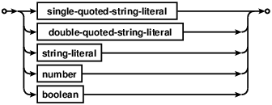
##### string-literal:

##### single-quoted-string-literal:
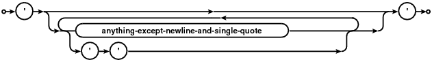
##### double-quoted-string-literal:

##### number:
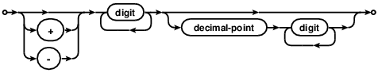
##### boolean:
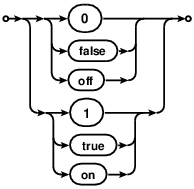
##### name:
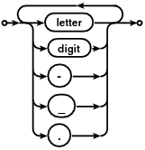
##### ws:
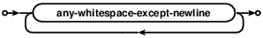
##### wsn:
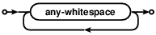

#### More formally:
Perl regular expression with explanation:
```
( file
	^(  line
		( directive
			[^\S\n]* ws
			[a-zA-Z0-9\-_]+ name
			[^\S\n]* ws
			(=|:) assign operator
			[^\S\n]* ws
			( value or array
				(    value - optional
					'([^'\n]|'')*' single-quoted
				|
					"([^"\n\\]|\\(['"?\\abfnrtv]|x[0-9a-fA-F]{2}))*" double-quoted
				|
					[a-zA-Z0-9\.:_+\-\*]+ string-literal
				|
					[0-9]+(\.[0-9]+)? numeric-literal
				|
					((?i)(on|off|true|false))
				)?
			|
				\[ array-begin
				(
					\s wsn
				|
					#[^\n]*\n comment
				)*
				( array contents - optional
					(    value
						'([^'\n]|'')*' single-quoted
					|
						"([^"\n\\]|\\(['"?\\abfnrtv]|x[0-9a-fA-F]{2}))*" double-quoted
					|
						[a-zA-Z0-9.:_+\-\*]+ string-literal
					|
						[0-9]+(\.[0-9]+)? numeric-literal
					|
						((?i)(on|off|true|false))
					)
					(
						\s wsn
					|
						#[^\n]*\n comment
					)*
					( next-array fields
						,
						(
							\s wsn
						|
							#[^\n]*\n comment
						)*
						(  value
							'([^'\n]|'')*' single-quoted
						|
							"([^"\n\\]|\\(['"?\\abfnrtv]|x[0-9a-fA-F]{2}))*" double-quoted
						|
							[a-zA-Z0-9.:_+\-\*]+ string-literal
						|
							[0-9]+(\.[0-9]+)? numeric-literal
						|
							((?i)(on|off|true|false))
						)
						(
							\s wsn
						|
							#[^\n]*\n comment
						)*
					)*
				)?
				\] array-end
			)
			[^\S\n]*  ws
			(
				#[^\n]*\n comment
			|
				\n newline
			)
		)
	|
		(
			[^\S\n]*  ws
			(
				#[^\n]*\n comment
			|
				\n newline
			)
		)
	)
)*
```
Valid Perl regular expression (config-file):
<!---
To get below regex from above regex use: `(\s+([a-zA-Z-]*\s*)*)` and delete matches.
-->
```
(^(([^\S\n]*[a-zA-Z0-9\-_]+[^\S\n]*(=|:)[^\S\n]*(('([^'\n]|'')*'|"([^"\n\\]|\\(['"?\\abfnrtv]|x[0-9a-fA-F]{2}))*"|[a-zA-Z0-9\.:_+\-\*]+|[0-9]+(\.[0-9]+)?|((?i)(on|off|true|false)))?|\[(\s|#[^\n]*\n)*(('([^'\n]|'')*'|"([^"\n\\]|\\(['"?\\abfnrtv]|x[0-9a-fA-F]{2}))*"|[a-zA-Z0-9.:_+\-\*]+|[0-9]+(\.[0-9]+)?|((?i)(on|off|true|false)))(\s|#[^\n]*\n)*(,(\s|#[^\n]*\n)*('([^'\n]|'')*'|"([^"\n\\]|\\(['"?\\abfnrtv]|x[0-9a-fA-F]{2}))*"|[a-zA-Z0-9.:_+\-\*]+|[0-9]+(\.[0-9]+)?|((?i)(on|off|true|false)))(\s|#[^\n]*\n)*)*)?\])[^\S\n]*(#[^\n]*\n|\n))|([^\S\n]*(#[^\n]*\n|\n))))*
```
